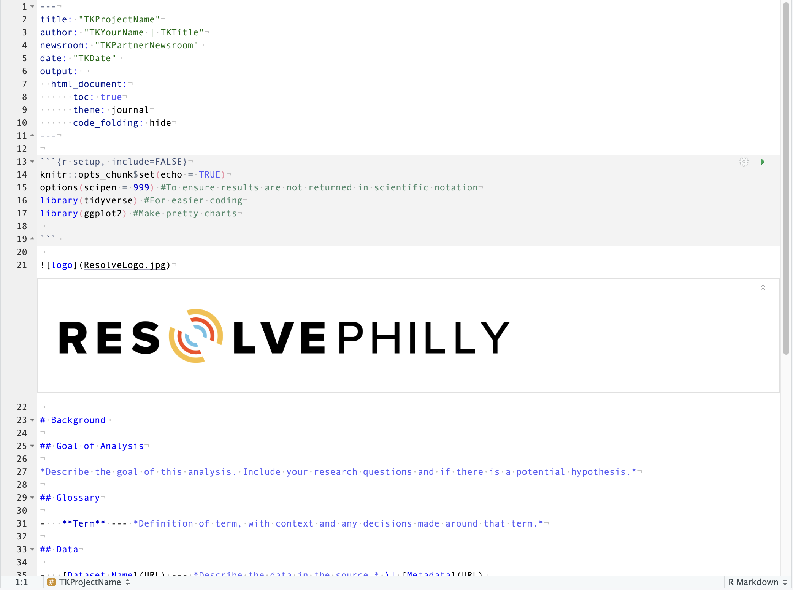

# Resolve Documentation Templates for Data Journalism Projects

Developed by Julie Christie, March 2024

This is a template structure for how Resolve communicates its data journalism work to newsroom and community partners or online for anyone to see and replicate. 

- [Resolve Documentation Templates for Data Journalism Projects](#resolve-documentation-templates-for-data-journalism-projects)
- [The Methodology Template](#the-methodology-template)
- [The Data Diary Template](#the-data-diary-template)
- [RStudio Methodology Template Package](#rstudio-methodology-template-package)
  - [Template Preview](#template-preview)
  - [Customize the R package for your organization](#customize-the-r-package-for-your-organization)
- [VSCode Snippets for Methodology and Data Diaries](#vscode-snippets-for-methodology-and-data-diaries)
  - [Set With Dependencies](#set-with-dependencies)
  - [Set Without Dependencies](#set-without-dependencies)
  - [Customize the Code Snippet for Your Organization](#customize-the-code-snippet-for-your-organization)
    - [Start a Data Diary](#start-a-data-diary)
    - [New Data Diary Entry](#new-data-diary-entry)
    - [Methodology Template](#methodology-template)
- [Pure Markdown](#pure-markdown)

> [!TIP]
> Anybody is welcome to use and customize this methodology structure for their work. See below to follow instructions to make your own template in various ways.

# The Methodology Template
The structure of this methodology template may look similar to a science project lab report, or even a published study. That's because it's modeled afte those. The idea was to create a structure that is familiar not just for journalists, but for people from other industries too. 

The other big thing about this structure is that the inclusion of sections like **Goal of Analysis, Glossary, Data, Tools, and Limitations** is very intentional. If a complete stranger, maybe even one who doesn't know how to code, were to look at this methodology -- would they know what you're doing and why? It's also important for transparency to outline specific terms and anything that may affect or limit the results of your work.

# The Data Diary Template
This can exist on its own, but was built in conjunction with the methodology. The Data Diary is intended to be internal for your organization. Perhaps it's something only the reporter and their editor can access, or even just the reporter.

This data diary structure is organized to create a detailed timeline of how the methodology came to be. This is where the trial and error, notes on decisions (which might make their way into the methodology), and personal lists of what to do next will go. Think of the Data Diary as the story-behind-the-story.

This template also includes a space to log professional development. Over time, we may add functionality to parse and compile those notes on your development.

:link: [Check out the data diary template](https://github.com/Resolve-Philly/Methodology-Template/blob/main/Data%20Diary%20Template.md)

This template currently only exists in markdown format to make it easy to include formulas and code snippets without worrying about weird spacing or quotation marks. However, it can be easily adapted into other word processors. 

# RStudio Methodology Template Package

This package was developed with lots of [references to Bookdown](https://bookdown.org/yihui/rmarkdown/document-templates.html).

1. Open RStudio and paste the below code in your console, one line at a time
    ```r
    if (!requireNamespace("devtools")) install.packages("devtools")
    devtools::install_github("Resolve-Philly/Methodology-Template-R")
    library(ResolveMethodology)
    ```
2. Click the button to add a new file and select R Markdown
3. Choose the **From Template** option and then select **Resolve Methodology Template** to get started
4. Each phrase with TK is a part of the template that you will need to fill in with your information.

## Template Preview



## Customize the R package for your organization

You can [fork this repository](https://docs.github.com/en/pull-requests/collaborating-with-pull-requests/working-with-forks/fork-a-repo) to create your own custom package. Below I've suggested the portions of the template that are best to customize.

- [ ] Change the logo at the top of the methodology
- [ ] Change the `newsroom` section in the YAML to whatever way collaboration shows up in your work
- [ ] Change the output information so you can knit the methodology to your preferred filetype and style
- [ ] Add in the packages your team should always use, as well as the common packages they'll often use
- [ ] Plug in all the API keys you will need to use
> [!CAUTION]
> If you add API keys, passwords, or other protected iformation you don't want on the internet, do not publish your methodology publicly.

# VSCode Snippets for Methodology and Data Diaries
This repo contains a `.code-snippet` file that you can use to create shortcuts to create the methodology and data diary templates in a `.md` file when using VSCode.

This setup comes with some dependencies to take advantage of features in other extensions. [See all the snippets in one place.]()

## Set With Dependencies
1. Save [vscode_methodology.code-snippets]() to **Code/User/snippets**.
2. Add the [Markdown All in One](https://marketplace.visualstudio.com/items?itemName=yzhang.markdown-all-in-one) extension and enable it.
3. Go to Markdown's settings and select **Extension keyboard shortcuts**
4. Edit the command for **Markdown All in One: Create Table of Contents** and set the keybinding to `cmd+t+c` to set up a keyboard shortcut to add a table of contents to your markdown documents.
> [!TIP]
> You can also set **Markdown All in One: Update Table of Contents** to `cmd+u+t` to update the table of contents.

## Set Without Dependencies
This removes a part of the snippet that assumes you have the Markdown All in One extension and set up a keyboard shortcut to generate tables of contents in your mardown files.

1. Save [vscode_methodology.code-snippets]() to **Code/User/snippets**.
2. Open the file and remove the line 
    ```
    "${5:Add a table of contents by typing cmd+t+c}",
    ```
    from the snippet labeled `"Start a Data Diary"`. 

3. Save the file


> [!TIP]
>The setup of the code snippets for Data Diaries will play well with [Todo Tree](https://marketplace.visualstudio.com/items?itemName=Gruntfuggly.todo-tree). The Data Diary has built-in spaces to mark your next steps. Todo Tree will automatically identify and show those to-dos without any customization.

## Customize the Code Snippet for Your Organization
You can mix and match code snippets from this file as well as customize them to be specific for your organization. Below are the individual snippets, along with a list of how you can make them your own.

> [!WARNING]
> Whenever you delete or add a placeholder, you should make sure that the numbers line up.

### Start a Data Diary

```json
"Start a Data Diary": {
		"prefix": "diary_new",
		"body": [
			"# ${1:Project Name}",
			"",
			"**Reporter:** ${2:Your Name}, ${3:Your Title}",
			"",
			"[Link to methodology](${4:Add the URL once you push to GitHub})",
			"",
			"${5:Add a table of contents by typing cmd+t+c}",
			"## $CURRENT_YEAR",
			"### $CURRENT_MONTH",
			"#### $CURRENT_DATE $CURRENT_MONTH_NAME_SHORT, $CURRENT_YEAR",
			"",
			"**Work Completed**",
			"- ${6: Describe what you've done today}",
			"",
            "> :star: **Professional Development**",
            "> ${7: Note something you learned or figured out, and explain why it is important.}",
            "",
			"**To Dos**",
			"- [ ] ${8: Write what you need to do next time}"
		],
		"description": "Data Diary header template"
	}
```
- [ ] Fill in your name and title, rather than leave them as placeholders
- [ ] Change the date hierarchy based on how long you may be working on the project.
### New Data Diary Entry

```json
"New Data Diary Entry":{
		"prefix": "diary_entry",
		"body": [
			"#### $CURRENT_DATE $CURRENT_MONTH_NAME_SHORT, $CURRENT_YEAR",
			"**Work Completed**",
			"- ${1:Describe what you've done today}",
			"",
            "> :star: **Professional Development**",
            "> ${2: Note something you learned or figured out, and explain why it is important for you.}",
            "",
			"**To Dos**",
			"- [ ] ${3:Write what you need to do next time.}"
		],
        "description": "Add entry to an existing Data Diary"
	}
```
- [ ] Add sections for the kind of work you'll be doing.

### Methodology Template
<details>
    <summary>Methodology snippet</summary>

```json
"Methodology Template":{
"prefix": "methodology_Resolve",
"body": [
    "",
    "",
    "# ${2: Your Project Name}",
    "",
    "**Author:** ${3: Your Name} | ${4:Your Title}",
    "",
    "**Partnering Team:** ${5:Partnering Newsroom, Organization, or Internal Department}",
    "",
    "**Date:** $CURRENT_DATE $CURRENT_MONTH_NAME_SHORT, $CURRENT_YEAR",
    "",
    "## Background",
    "",
    "### Goal of Analysis",
    "",
    "Describe the goal of this analysis. Include your research questions and if there is a potential hypothesis.",
    "",
    "### Glossary",
    "",
    "-   **Term** --- *Definition of term, with context and any decisions made around that term.*",
    "",
    "### Data",
    "",
    "-   [Dataset Name](URL) --- *Describe the data in the source.* | [Metadata](URL)",
    "",
    "### Tools",
    "",
    "-   [Tool](URL) --- *Describe what the tool was used for*",
    "",
    "> [!NOTE] I recommend including the key add-ons that you will always use in your analysis, with a quick explanation of what that tool does. You can also create a section that lists common add-ons and what they do, or API access keys you'll need to use them.",
    "",
    "### Limitations",
    "",
    "> [!IMPORTANT] Include clear limitations or caveats to your analysis here. For example, the data may have gaps or the code may only be able to handle so much.",
    "",
    "## Cleaning",
    "",
    "> [!IMPORTANT] Below you will document all code processes, in or out of any specific tool that you used to clean the data. You can break out your cleaning process into subsections to make navigation easier.",
    "",
    "1.  Describe what your code is doing in plain english, with a step number to help organize the process",
    "",
    "```",       
    "// Put the code for that step in a chunk that can be separated out. ",
    "// If you have to scroll to see the contents of a whole chunk, it might be too long and could be broken into smaller steps.",
    "```",
    "",
    "## Analysis",
    "",
    "> [!IMPORTANT] Include step-by-step instructions and code for your analysis of the data and explain the results that appear. You can break out your analysis into subsections to make navigation easier.",
    "",
    "1.  Describe what your code is doing in plain english, with a step number to help organize the process",
    "",
    "```",       
    "// Put the code for that step in a chunk that can be separated out. ",
    "```",
    "",
    "## Future Work or Questions",
    "",
    "> [!IMPORTANT] Make a note of questions this analysis left unanswered, follow-up work that could come in the future, or notes for how to revisit/improve the analysis in the future."
],
"description": "Create a methodology outline"
}
```
</details>

- [ ] Change the logo at the top of the methodology
- [ ] Change the `newsroom` section to whatever way collaboration shows up in your work
- [ ] Add in the tools or steps your team should always follow
- [ ] Add more code snippets for different types of code chunks that you will be using.

# Pure Markdown

You can get a basic markdown file of this methodology structure as well. If you jump to [Template Markdown](https://github.com/Resolve-Philly/Methodology-Template-R/blob/main/Template%20Markdown.md), you can just directly save the file and customize to your heart's desire for your other programs. 

Updates specifically for other tools to export to much more "human friendly" views like a `.pdf` or `.html` document may be done in the future.
